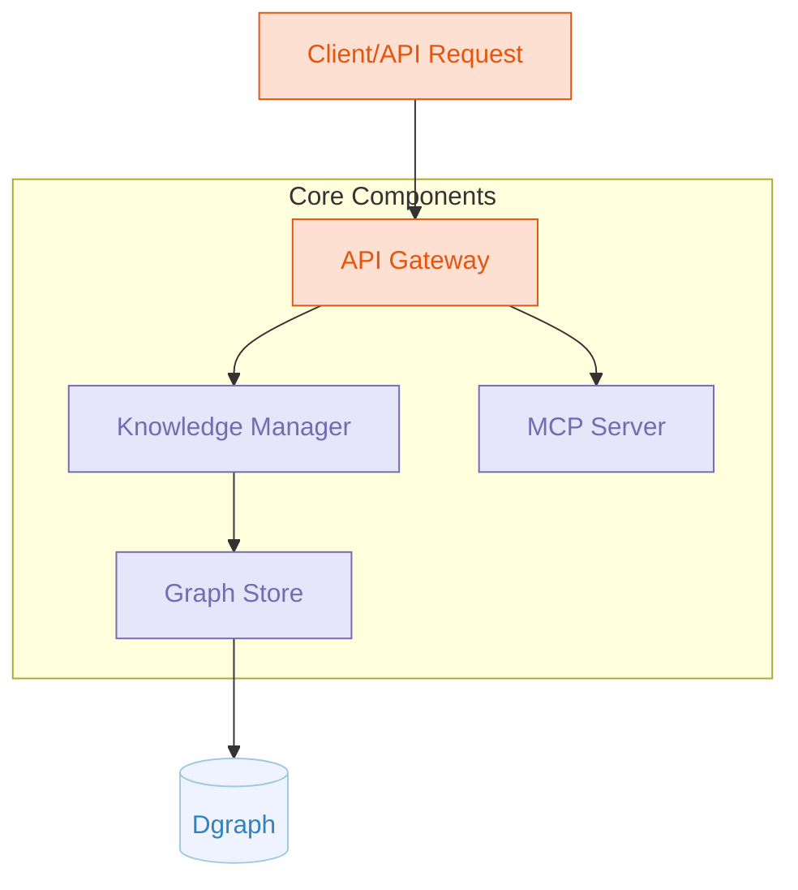

# Go Knowledge Graph System Architecture

A Golang-based knowledge graph system that integrates Dgraph with MCP-go support.

mcp-graph is a lightweight, self-hosted knowledge graph system built in Go with a modular architecture that allows for flexible deployment options. The core system provides efficient data ingestion, graph-based storage, and powerful querying capabilities using Dgraph as the primary database. The system includes the following key components:

- **MCP Server**: Deployed as a Model Context Protocol server (using mark3labs/mcp-go) to provide standardized LLM tool interfaces, enabling seamless integration with various AI applications. Supports both stdio and SSE modes for flexible connectivity.

The system's clean, modular design makes it ideal for knowledge management applications, research tools, and content organization systems, with each component being independently configurable. The MCP server integration provides a standardized way for AI applications to interact with your knowledge graph.

Future enhancements may include:

- A way to explore the graph visually
- A way to export the graph to a file format (e.g., JSON, CSV)
- A way to import data from other sources (e.g., CSV, JSON)

## System Architecture

Here's a diagram of the proposed architecture:



## Project Structure

```tree
knowledge-graph-go/
├── cmd/
│   └── server/                 # Main application entry point
├── internal/
│   ├── api/                    # API handlers
│   ├── config/                 # Configuration management
│   ├── graph/                  # Knowledge graph implementation
│   │   └── dgraph/             # Dgraph implementation
│   ├── mcp/                    # MCP server
│   └── service/                # Core business logic
├── pkg/
│   ├── models/                 # Shared data models
│   └── utils/                  # Utility functions
└── scripts/                    # Deployment and tooling scripts
└── .gitignore                  # Git ignore file
└── .env.example                # Example environment variables
└── Dockerfile                  # Dockerfile for containerisation
└── docker-compose.yml          # Example Docker Compose for containerised deployment that includes Dgraph
└── mcp-client.json             # Example MCP client configuration (for use with Cline, Claude Desktop etc.)
└── README.md                   # Project documentation
```

## Key Interfaces

### 1. Core Knowledge Graph Interface

```go
// graph/graph.go
package graph

import "context"

// Store defines the core knowledge graph operations
type Store interface {
    // Node operations
    CreateNode(ctx context.Context, nodeType string, properties map[string]interface{}) (string, error)
    GetNode(ctx context.Context, id string) (map[string]interface{}, error)
    UpdateNode(ctx context.Context, id string, properties map[string]interface{}) error
    DeleteNode(ctx context.Context, id string) error

    // Edge operations
    CreateEdge(ctx context.Context, fromID, toID, relationshipType string, properties map[string]interface{}) (string, error)

    // Query operations
    Query(ctx context.Context, query string, params map[string]interface{}) ([]map[string]interface{}, error)

    // Schema operations
    UpsertSchema(ctx context.Context, schema string) error
}
```


## Implementation Examples

Note: These are only examples from my brainstorming used to help describe my idea and not representative of the final code.

### Dgraph Implementation

```go
// graph/dgraph/store.go
package dgraph

import (
    "context"
    "github.com/dgraph-io/dgo/v2"
    "github.com/dgraph-io/dgo/v2/protos/api"
    "google.golang.org/grpc"
    "github.com/sammcj/mcp-graph/internal/graph"
)

type DgraphStore struct {
    client *dgo.Dgraph
}

func NewDgraphStore(address string) (*DgraphStore, error) {
    conn, err := grpc.Dial(address, grpc.WithInsecure())
    if err != nil {
        return nil, err
    }

    client := dgo.NewDgraphClient(api.NewDgraphClient(conn))
    return &DgraphStore{client: client}, nil
}

// Implement graph.Store interface
func (s *DgraphStore) CreateNode(ctx context.Context, nodeType string, properties map[string]interface{}) (string, error) {
    // Implementation...
    properties["type"] = nodeType
    txn := s.client.NewTxn()
    defer txn.Discard(ctx)

    // Create mutation
    pb, err := json.Marshal(properties)
    if err != nil {
        return "", err
    }

    mu := &api.Mutation{
        SetJson: pb,
        CommitNow: true,
    }

    resp, err := txn.Mutate(ctx, mu)
    if err != nil {
        return "", err
    }

    // Return UID of created node
    return resp.Uids["blank-0"], nil
}

// Implement other methods of the graph.Store interface...
```


### MCP Server Integration

```go
// mcp/server.go
package mcp

import (
    "context"
    "errors"
    "fmt"
    "github.com/mark3labs/mcp-go/mcp"
    "github.com/mark3labs/mcp-go/server"
    "github.com/sammcj/mcp-graph/internal/graph"
)

type MCPServer struct {
    server   *server.MCPServer
    graph    graph.Store
}

func NewMCPServer(name, version string, graph graph.Store) *MCPServer {
    s := server.NewMCPServer(
        name,
        version,
        server.WithResourceCapabilities(true, true),
    )

    return &MCPServer{
        server: s,
        graph:  graph,
    }
}

func (s *MCPServer) SetupTools() {
    // Create query tool
    queryTool := mcp.NewTool("query_knowledge_graph",
        mcp.WithDescription("Query the knowledge graph"),
        mcp.WithString("query",
            mcp.Required(),
            mcp.Description("The query to execute"),
        ),
    )

    // Add tool handler
    s.server.AddTool(queryTool, s.handleQueryTool)

}

func (s *MCPServer) handleQueryTool(ctx context.Context, request mcp.CallToolRequest) (*mcp.CallToolResult, error) {
    query, ok := request.Params.Arguments["query"].(string)
    if !ok {
        return nil, errors.New("query must be a string")
    }

    // Execute query against graph
    results, err := s.graph.Query(ctx, query, nil)
    if err != nil {
        return nil, err
    }

    // Format and return results
    return mcp.NewToolResultJSON(results), nil
}


func (s *MCPServer) ServeStdio() error {
    return server.ServeStdio(s.server)
}

func (s *MCPServer) ServeSSE(addr string) error {
    return server.ServeHTTP(s.server, addr)
}
```

## Main Application Integration

```go
// cmd/server/main.go
package main

import (
    "context"
    "flag"
    "log"
    "os"
    "os/signal"
    "syscall"

    "github.com/sammcj/mcp-graph/internal/api"
    "github.com/sammcj/mcp-graph/internal/config"
    "github.com/sammcj/mcp-graph/internal/graph/dgraph"
    "github.com/sammcj/mcp-graph/internal/mcp"
)

func main() {
    configPath := flag.String("config", "config.yaml", "Path to configuration file")
    flag.Parse()

    // Load config
    cfg, err := config.LoadConfig(*configPath)
    if err != nil {
        log.Fatalf("Failed to load config: %v", err)
    }

    // Initialize graph store
    graphStore, err := dgraph.NewDgraphStore(cfg.Dgraph.Address)
    if err != nil {
        log.Fatalf("Failed to connect to Dgraph: %v", err)
    }

    // Create API server
    apiServer := api.NewServer(cfg.API.Port, graphStore)

    // Start MCP server
    mcpServer := mcp.NewMCPServer(
        cfg.App.Name,
        cfg.App.Version,
        graphStore,
    )
        mcpServer.SetupTools()

    if cfg.MCP.UseSSE {
        go func() {
            if err := mcpServer.ServeSSE(cfg.MCP.Address); err != nil {
                log.Printf("MCP SSE server failed: %v", err)
            }
        }()
    } else {
        go func() {
            if err := mcpServer.ServeStdio(); err != nil {
                log.Printf("MCP stdio server failed: %v", err)
            }
        }()
    }

    // Start API server
    go func() {
        if err := apiServer.Start(); err != nil {
            log.Fatalf("API server failed: %v", err)
        }
    }()

    // Wait for shutdown signal
    quit := make(chan os.Signal, 1)
    signal.Notify(quit, syscall.SIGINT, syscall.SIGTERM)
    <-quit

    // Graceful shutdown
    ctx, cancel := context.WithTimeout(context.Background(), cfg.Shutdown.Timeout)
    defer cancel()

    log.Println("Shutting down services...")
    if err := apiServer.Shutdown(ctx); err != nil {
        log.Printf("API server shutdown failed: %v", err)
    }
}
```

## Configuration Example

```yaml
# config.yaml
app:
  name: "Knowledge Graph Service"
  version: "1.0.0"

api:
  port: 8080

dgraph:
  address: "localhost:9080"

mcp:
  useSSE: true
  address: ":3000"

shutdown:
  timeout: 5s
```

## Advantages of This Architecture

1. **Modularity**: The graph component has a clean interface that can be implemented by different backends
2. **MCP Integration**: The MCP server provides a standardized way for AI applications to interact with the knowledge graph
3. **Clean Separation**: Business logic is separated from implementation details
4. **Extensibility**: Easy to add new features or swap out components

This architecture provides a solid foundation for a clean and simple Go-based knowledge graph + vector + MCP server.
The interfaces allow for future extensions or provider swaps without major refactoring.
