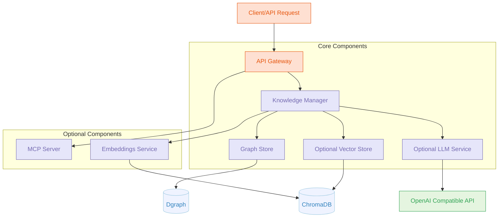

# Go Knowledge Graph System Architecture

A Golang-based knowledge graph system that integrates Dgraph with optional MCP-go and Chroma-go support.

mcp-graph is a lightweight, self-hosted knowledge graph system built in Go with a modular architecture that allows for flexible deployment options. The core system provides efficient data ingestion, graph-based storage, and powerful querying capabilities using Dgraph as the primary database. The system is designed with optional components that can be enabled based on your specific needs:

- **Optional LLM Integration**: Connect to any OpenAI-compatible API to enhance your knowledge graph with AI-powered summaries, question answering, and content generation. The system works perfectly well without LLM integration if you prefer a pure graph database solution.
- **Optional Vector Embeddings**: Integrate with ChromaDB (via amikos-tech/chroma-go) to add semantic search capabilities, allowing for similarity-based queries and content retrieval. The embedding process can use any compatible embedding model of your choice.
- **Optional MCP Server**: Deploy as a Model Context Protocol server (using mark3labs/mcp-go) to provide standardized LLM tool interfaces, enabling seamless integration with various AI applications. Supports both stdio and SSE modes for flexible connectivity.

The system's clean, modular design makes it ideal for knowledge management applications, research tools, and content organization systems, with each component being independently configurable. Start with just the core graph database functionality and incrementally add LLM capabilities, vector search, or MCP protocol support as your needs evolve.

Future enhancements may include:

- A way to explore the graph visually
- A way to export the graph to a file format (e.g., JSON, CSV)
- A way to import data from other sources (e.g., CSV, JSON)

## System Architecture

Here's a diagram of the proposed architecture:



## Project Structure

```tree
knowledge-graph-go/
├── cmd/
│   └── server/                 # Main application entry point
├── internal/
│   ├── api/                    # API handlers
│   ├── config/                 # Configuration management
│   ├── graph/                  # Knowledge graph implementation
│   │   └── dgraph/             # Dgraph implementation
│   ├── llm/                    # LLM client interface
│   │   └── openai/             # Optional OpenAI-compatible client
│   ├── mcp/                    # Optional MCP server
│   ├── vector/                 # Optional Vector DB abstraction
│   │   └── chroma/             # Optional ChromaDB implementation
│   └── service/                # Core business logic
├── pkg/
│   ├── models/                 # Shared data models
│   └── utils/                  # Utility functions
└── scripts/                    # Deployment and tooling scripts
└── .gitignore                  # Git ignore file
└── .env.example                # Example environment variables
└── Dockerfile                  # Dockerfile for containerisation
└── docker-compose.yml          # Example Docker Compose for containerised deployment
└── mcp-client.json             # Example MCP client configuration (for use with Cline, Claude Desktop etc.)
└── README.md                   # Project documentation
```

## Key Interfaces

### 1. Core Knowledge Graph Interface

```go
// graph/graph.go
package graph

import "context"

// Store defines the core knowledge graph operations
type Store interface {
    // Node operations
    CreateNode(ctx context.Context, nodeType string, properties map[string]interface{}) (string, error)
    GetNode(ctx context.Context, id string) (map[string]interface{}, error)
    UpdateNode(ctx context.Context, id string, properties map[string]interface{}) error
    DeleteNode(ctx context.Context, id string) error

    // Edge operations
    CreateEdge(ctx context.Context, fromID, toID, relationshipType string, properties map[string]interface{}) (string, error)

    // Query operations
    Query(ctx context.Context, query string, params map[string]interface{}) ([]map[string]interface{}, error)

    // Schema operations
    UpsertSchema(ctx context.Context, schema string) error
}
```

### 2. Vector Database Interface

```go
// vector/vector.go
package vector

import "context"

// Store defines vector database operations
type Store interface {
    // Collection operations
    CreateCollection(ctx context.Context, name string, metadata map[string]interface{}) error
    DeleteCollection(ctx context.Context, name string) error

    // Document operations
    AddDocuments(ctx context.Context, collection string, docs []Document, metadatas []map[string]interface{}) error
    QueryCollection(ctx context.Context, collection string, queryTexts []string, n int) ([]Document, []float32, error)
}

// Document represents a document with optional embedding
type Document struct {
    ID        string
    Text      string
    Embedding []float32
}
```

### 3. LLM Service Interface

```go
// llm/llm.go
package llm

import "context"

// Service defines LLM operations
type Service interface {
    // Core operations
    GenerateText(ctx context.Context, prompt string, options *GenerateOptions) (string, error)
    GenerateEmbedding(ctx context.Context, text string) ([]float32, error)

    // Stream responses when needed
    StreamText(ctx context.Context, prompt string, options *GenerateOptions) (<-chan string, error)
}

// GenerateOptions holds parameters for generation
type GenerateOptions struct {
    Model       string
    MaxTokens   int
    Temperature float32
    // other OpenAI compatible parameters
}
```

## Implementation Examples

Note: These are only examples from my brainstorming used to help describe my idea and not representative of the final code.

### Dgraph Implementation

```go
// graph/dgraph/store.go
package dgraph

import (
    "context"
    "github.com/dgraph-io/dgo/v2"
    "github.com/dgraph-io/dgo/v2/protos/api"
    "google.golang.org/grpc"
    "github.com/sammcj/mcp-graph/internal/graph"
)

type DgraphStore struct {
    client *dgo.Dgraph
}

func NewDgraphStore(address string) (*DgraphStore, error) {
    conn, err := grpc.Dial(address, grpc.WithInsecure())
    if err != nil {
        return nil, err
    }

    client := dgo.NewDgraphClient(api.NewDgraphClient(conn))
    return &DgraphStore{client: client}, nil
}

// Implement graph.Store interface
func (s *DgraphStore) CreateNode(ctx context.Context, nodeType string, properties map[string]interface{}) (string, error) {
    // Implementation...
    properties["type"] = nodeType
    txn := s.client.NewTxn()
    defer txn.Discard(ctx)

    // Create mutation
    pb, err := json.Marshal(properties)
    if err != nil {
        return "", err
    }

    mu := &api.Mutation{
        SetJson: pb,
        CommitNow: true,
    }

    resp, err := txn.Mutate(ctx, mu)
    if err != nil {
        return "", err
    }

    // Return UID of created node
    return resp.Uids["blank-0"], nil
}

// Implement other methods of the graph.Store interface...
```

### ChromaDB Integration

```go
// vector/chroma/store.go
package chroma

import (
    "context"
    "github.com/amikos-tech/chroma-go"
    "github.com/amikos-tech/chroma-go/collection"
    "github.com/amikos-tech/chroma-go/types"
    "github.com/sammcj/mcp-graph/internal/vector"
)

type ChromaStore struct {
    client *chroma.Client
    embedFunc types.EmbeddingFunction
}

func NewChromaStore(address string, embedFunc types.EmbeddingFunction) (*ChromaStore, error) {
    client, err := chroma.NewClient(chroma.WithBasePath(address))
    if err != nil {
        return nil, err
    }

    return &ChromaStore{
        client: client,
        embedFunc: embedFunc,
    }, nil
}

// Implement vector.Store interface
func (s *ChromaStore) CreateCollection(ctx context.Context, name string, metadata map[string]interface{}) error {
    meta := make(map[string]interface{})
    for k, v := range metadata {
        meta[k] = v
    }

    _, err := s.client.CreateCollection(
        ctx,
        name,
        collection.WithMetadata(meta),
        collection.WithEmbeddingFunction(s.embedFunc),
    )
    return err
}

func (s *ChromaStore) AddDocuments(ctx context.Context, collectionName string, docs []vector.Document, metadatas []map[string]interface{}) error {
    // Implementation...
    c, err := s.client.GetCollection(ctx, collectionName)
    if err != nil {
        return err
    }

    // Create recordset
    rs, err := types.NewRecordSet(
        types.WithEmbeddingFunction(c.EmbeddingFunction),
    )
    if err != nil {
        return err
    }

    // Add records to the set
    for i, doc := range docs {
        var meta map[string]interface{}
        if i < len(metadatas) {
            meta = metadatas[i]
        }

        rs.WithRecord(
            types.WithID(doc.ID),
            types.WithDocument(doc.Text),
            types.WithMetadata(meta),
        )
    }

    // Add records to collection
    _, err = c.AddRecords(ctx, rs)
    return err
}

// Implement other methods
```

### MCP Server Integration

```go
// mcp/server.go
package mcp

import (
    "context"
    "errors"
    "fmt"
    "github.com/mark3labs/mcp-go/mcp"
    "github.com/mark3labs/mcp-go/server"
    "github.com/sammcj/mcp-graph/internal/graph"
    "github.com/sammcj/mcp-graph/internal/llm"
)

type MCPServer struct {
    server   *server.MCPServer
    graph    graph.Store
    llmSvc   llm.Service
}

func NewMCPServer(name, version string, graph graph.Store, llmSvc llm.Service) *MCPServer {
    s := server.NewMCPServer(
        name,
        version,
        server.WithResourceCapabilities(true, true),
    )

    return &MCPServer{
        server: s,
        graph:  graph,
        llmSvc: llmSvc,
    }
}

func (s *MCPServer) SetupTools() {
    // Create query tool
    queryTool := mcp.NewTool("query_knowledge_graph",
        mcp.WithDescription("Query the knowledge graph"),
        mcp.WithString("query",
            mcp.Required(),
            mcp.Description("The query to execute"),
        ),
    )

    // Add tool handler
    s.server.AddTool(queryTool, s.handleQueryTool)

    // Add generate summary tool
    summaryTool := mcp.NewTool("generate_summary",
        mcp.WithDescription("Generate a summary from the knowledge graph"),
        mcp.WithString("topic",
            mcp.Required(),
            mcp.Description("The topic to summarize"),
        ),
    )

    s.server.AddTool(summaryTool, s.handleSummaryTool)
}

func (s *MCPServer) handleQueryTool(ctx context.Context, request mcp.CallToolRequest) (*mcp.CallToolResult, error) {
    query, ok := request.Params.Arguments["query"].(string)
    if !ok {
        return nil, errors.New("query must be a string")
    }

    // Execute query against graph
    results, err := s.graph.Query(ctx, query, nil)
    if err != nil {
        return nil, err
    }

    // Format and return results
    return mcp.NewToolResultJSON(results), nil
}

func (s *MCPServer) handleSummaryTool(ctx context.Context, request mcp.CallToolRequest) (*mcp.CallToolResult, error) {
    topic, ok := request.Params.Arguments["topic"].(string)
    if !ok {
        return nil, errors.New("topic must be a string")
    }

    // Query graph for relevant data
    query := fmt.Sprintf(`
        {
            q(func: eq(type, "Document")) @filter(anyofterms(content, "%s")) {
                uid
                title
                content
            }
        }
    `, topic)

    results, err := s.graph.Query(ctx, query, nil)
    if err != nil {
        return nil, err
    }

    // Generate summary using LLM
    prompt := fmt.Sprintf("Summarize the following information about %s:\n\n%v", topic, results)
    summary, err := s.llmSvc.GenerateText(ctx, prompt, nil)
    if err != nil {
        return nil, err
    }

    return mcp.NewToolResultText(summary), nil
}

func (s *MCPServer) ServeStdio() error {
    return server.ServeStdio(s.server)
}

func (s *MCPServer) ServeSSE(addr string) error {
    return server.ServeHTTP(s.server, addr)
}
```

## Main Application Integration

```go
// cmd/server/main.go
package main

import (
    "context"
    "flag"
    "log"
    "os"
    "os/signal"
    "syscall"

    "github.com/sammcj/mcp-graph/internal/api"
    "github.com/sammcj/mcp-graph/internal/config"
    "github.com/sammcj/mcp-graph/internal/graph/dgraph"
    "github.com/sammcj/mcp-graph/internal/llm/openai"
    "github.com/sammcj/mcp-graph/internal/mcp"
    "github.com/sammcj/mcp-graph/internal/vector/chroma"
)

func main() {
    configPath := flag.String("config", "config.yaml", "Path to configuration file")
    flag.Parse()

    // Load config
    cfg, err := config.LoadConfig(*configPath)
    if err != nil {
        log.Fatalf("Failed to load config: %v", err)
    }

    // Initialize graph store
    graphStore, err := dgraph.NewDgraphStore(cfg.Dgraph.Address)
    if err != nil {
        log.Fatalf("Failed to connect to Dgraph: %v", err)
    }

    // Initialize LLM service
    llmService, err := openai.NewOpenAIService(cfg.OpenAI.APIKey, cfg.OpenAI.BaseURL)
    if err != nil {
        log.Fatalf("Failed to initialize LLM service: %v", err)
    }

    // Initialize vector store if enabled
    var vectorStore *chroma.ChromaStore
    if cfg.Chroma.Enabled {
        // Create embedding function
        embedFunc, err := openai.NewEmbeddingFunction(cfg.OpenAI.APIKey, cfg.OpenAI.EmbeddingModel)
        if err != nil {
            log.Fatalf("Failed to create embedding function: %v", err)
        }

        vectorStore, err = chroma.NewChromaStore(cfg.Chroma.Address, embedFunc)
        if err != nil {
            log.Fatalf("Failed to connect to ChromaDB: %v", err)
        }
    }

    // Create API server
    apiServer := api.NewServer(cfg.API.Port, graphStore, llmService, vectorStore)

    // Start MCP server if enabled
    if cfg.MCP.Enabled {
        mcpServer := mcp.NewMCPServer(
            cfg.App.Name,
            cfg.App.Version,
            graphStore,
            llmService,
        )
        mcpServer.SetupTools()

        if cfg.MCP.UseSSE {
            go func() {
                if err := mcpServer.ServeSSE(cfg.MCP.Address); err != nil {
                    log.Printf("MCP SSE server failed: %v", err)
                }
            }()
        } else {
            go func() {
                if err := mcpServer.ServeStdio(); err != nil {
                    log.Printf("MCP stdio server failed: %v", err)
                }
            }()
        }
    }

    // Start API server
    go func() {
        if err := apiServer.Start(); err != nil {
            log.Fatalf("API server failed: %v", err)
        }
    }()

    // Wait for shutdown signal
    quit := make(chan os.Signal, 1)
    signal.Notify(quit, syscall.SIGINT, syscall.SIGTERM)
    <-quit

    // Graceful shutdown
    ctx, cancel := context.WithTimeout(context.Background(), cfg.Shutdown.Timeout)
    defer cancel()

    log.Println("Shutting down services...")
    if err := apiServer.Shutdown(ctx); err != nil {
        log.Printf("API server shutdown failed: %v", err)
    }
}
```

## Configuration Example

```yaml
# config.yaml
app:
  name: "Knowledge Graph Service"
  version: "1.0.0"

api:
  port: 8080

dgraph:
  address: "localhost:9080"

openai:
  apiKey: "${OPENAI_API_KEY}"
  baseURL: "http://ollama:11434/v1"  # Can be changed for compatible providers
  model: "eramax/gemma-3-27b-it-qat:q4_0"
  embeddingModel: "snowflake-arctic-embed2:latest"

chroma:
  enabled: true
  address: "http://localhost:8000"

mcp:
  enabled: true
  useSSE: true
  address: ":3000"

shutdown:
  timeout: 5s
```

## Advantages of This Architecture

1. **Modularity**: Each component (graph, vector, LLM) has a clean interface that can be implemented by different backends
2. **Optional Components**: MCP and Chroma are only initialized if enabled in config
3. **Flexible LLM Support**: The LLM interface works with any OpenAI API-compatible provider
4. **Clean Separation**: Business logic is separated from implementation details
5. **Extensibility**: Easy to add new features or swap out components

This architecture provides a solid foundation for a clean and simple Go-based knowledge graph + vector + MCP server.
The interfaces allow for future extensions or provider swaps without major refactoring.
